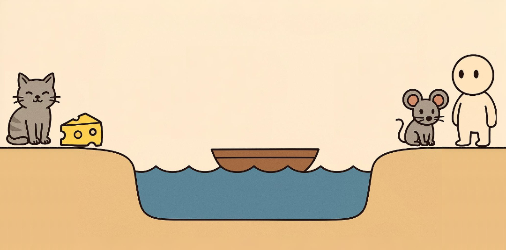

# 🚤 River Crossing Game: Save the Day!

Welcome to the **River Crossing Puzzle**!  
Your mission? Get a human, a mouse, a cat, and a piece of cheese across the river safely... without anyone eating anyone else! 🧀🐭🐱

<div align="center">
  
  <br>
  <em>Can you outsmart the hungry cat and sneaky mouse? 🐱🧀</em>
</div>

## 🎮 What’s the Game?

This is a fun and challenging **console game** written in **C++**.  
A classic logic puzzle with a twist! Guide four characters across the river while preventing:
- 🐱 **Cat** from eating 🐭 **Mouse**
- 🐭 **Mouse** from eating 🧀 **Cheese**
- ⏱️ All within **15 moves**!

```diff
+ Perfect solution exists in just 7 moves!
```

---

## 🕹️ How to Play

### 🎮 Controls
Once you start the game, you'll get a menu like this:

```
[1] Move Human alone      
[2] Move Human + Mouse         
[3] Move Human + Cat           
[4] Move Human + Cheese        
```

Use the number keys to choose a move. BUT:

### 📏 Rules

| ✅ Must Haves       | ❌ Must Not Haves         |
|--------------------|--------------------------|
| Only the human can row the boat | Cat and Mouse alone together |
| Max of 15 moves     | Mouse and Cheese alone together |


Think carefully and plan your moves! 🧠

---


## 🧱 How It Works

The game uses simple **ASCII art** to show where each character is after every move. It even checks:

- Are any dangerous pairs alone together? 😱
- Are the characters on the correct side to be picked up? 🚫
- Did you win by getting everyone to the other side safely? 🎉

---

## 🏆 Achievements

| 🏅 Badge        | 🔓 Condition               |
|----------------|----------------------------|
| 🧠 Mastermind   | Solve the puzzle in 7 moves|
| ⏳ Close Call   | Win on the 15th move       |
| 😅 Lucky        | Break rules but somehow win|


---

## 🛠️ How to Run

1. Make sure you have a **C++ compiler** (like g++) installed.
2. Compile the code:

   ```bash
   g++ river_game.cpp -o river_game
   ```

3. Run the game:

   ```bash
   ./river_game
   ```

Enjoy the puzzle! 🤓

---

## 📁 File Structure

```
📄 river_game.cpp   → Main game code  
📄 README.md        → This file (game instructions & info)
🎨 River-Game.png   → Promotional artwork 

```

---


## 📜 Credits

Developed by Salwa Alhajali with ❤️ using:
- C++17
- Terminal magic ✨
- Classic logic puzzle fun 🧩

